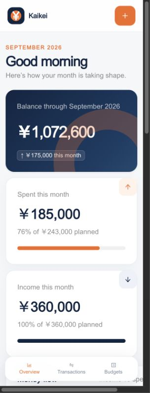

# Kaikei Demo

Kaikei Demo is a safe, standalone version of the Kaikei personal-expense tracker. It lets people explore income, expense, transaction, and budget workflows using fictional 2026 finances—without connecting to the private production ledger or Google Sheet.

[Open the hosted demo](https://kaikei-demo-2026.ktanzyl.chatgpt.site)

> **Demo safety:** every included record is synthetic. Changes are saved only in the current browser using `localStorage` and never sync to the production app, Google Sheets, or another visitor.

## Screenshot

<p align="center">
  
</p>

## What you can try

- Review the current balance, monthly spending, monthly income, and net cash flow.
- Compare income and expenses across the available 2026 months.
- Browse recent activity and category budget progress.
- Add new income or expense transactions.
- Edit and delete transactions.
- Search transactions by description or category.
- Filter the ledger by income or expense.
- Edit planned amounts for individual budget categories.
- Switch between expense and income budgets.
- Reset the entire demo to its original sample data at any time.
- Install the responsive interface on an iPhone or iPad home screen.

## Demo data and persistence

The initial dataset lives in `lib/seed-data.json`. On first load, Kaikei makes a browser-local copy under the storage key `kaikei-demo-ledger-v1`.

```text
Synthetic seed data
        ↓ first visit / reset
Browser localStorage
        ↓
Overview, transactions, and budgets
```

Adding a transaction, editing an entry, deleting an entry, or changing a planned amount updates only that browser-local copy. Refreshing the page preserves the changes on the same device and browser. **Reset demo** replaces them with a fresh copy of the bundled sample data.

Clearing site data or using a different browser starts a separate demo session. There is no user account, shared server database, analytics pipeline, or Google Sheet connection in this demo.

## Demo versus production

| Area | Demo | Production Kaikei |
|---|---|---|
| Financial records | Fictional sample data | Owner's private financial data |
| Persistence | Browser `localStorage` | Private Google Sheet with server-side sync |
| Cross-device sync | No | Yes, through the Sheet |
| Reset button | Restores the bundled sample | Not provided |
| Deployment | Separate Sites project | Separate owner-only Sites project |
| Repository | This demo repository | Private production repository |

The two apps have separate source histories, deployments, and storage behavior. No production balance, transaction, category, spreadsheet credential, or Sheet content is included here.

## Design

Kaikei uses Ant Design as its interface foundation, extended with a custom orange-and-navy visual system:

- Navy `#102542` for primary surfaces, typography, and income indicators.
- Orange `#F26A21` for actions, expenses, and emphasis.
- Responsive desktop sidebar and mobile bottom navigation.
- Touch-friendly transaction and budget forms.
- A yen-symbol app icon sized for favicons, PWA installation, and the iOS home screen.

## Technology

- React 19 and TypeScript
- Vinext and Vite
- Ant Design and Ant Design Icons
- Day.js
- OpenAI Sites hosting
- Web App Manifest, Apple web-app metadata, and Open Graph metadata
- Browser `localStorage` for isolated demo persistence

## Project structure

```text
app/
  globals.css          Responsive Kaikei visual system
  layout.tsx           Metadata, PWA, iOS, and social configuration
  page.tsx             Demo state and all dashboard workflows
  providers.tsx        Ant Design app provider
lib/
  seed-data.json       Fictional monthly budgets and transactions
public/
  icons/               App and iOS home-screen icons
  manifest.webmanifest Installable-app manifest
  og.png               Social preview image
docs/
  kaikei-demo-dashboard.jpg
```

## Local development

### Requirements

- Node.js 22 or newer
- npm

### Start the app

```bash
git clone https://github.com/kebin20/kaikei-expense-tracker-demo.git
cd kaikei-expense-tracker-demo
npm ci
npm run dev
```

Open the local URL shown in the terminal. No environment variables, spreadsheet access, or external credentials are required.

### Quality checks

```bash
npm run lint
npm run build
npx tsc --noEmit --incremental false
```

## Installing on iOS

1. Open the hosted demo in Safari.
2. Tap **Share**.
3. Choose **Add to Home Screen**.
4. Confirm the name **Kaikei Demo**.

The dedicated Apple touch icon is used for the installed shortcut. If iOS shows an older cached icon, remove the shortcut and add it again.

## WebMCP support

Browsers that support WebMCP can use the focused `add_transaction` action to add one fictional income or expense entry. The action validates the date, amount, description, type, and category before updating the same local demo ledger.

## Deployment

The demo is built and published independently through OpenAI Sites. A deployment contains only the compiled application and synthetic seed data. Production Google Sheet settings and secrets must never be added to this project.

## Privacy notes

- Do not replace the synthetic seed with real financial information.
- Do not add production Google Sheet URLs, secrets, or exported workbook data.
- Browser-local changes remain on the device until the site data is cleared or the demo is reset.
- Use this repository for demonstrations, screenshots, reviews, and portfolio sharing; keep real financial data in the private production project.
